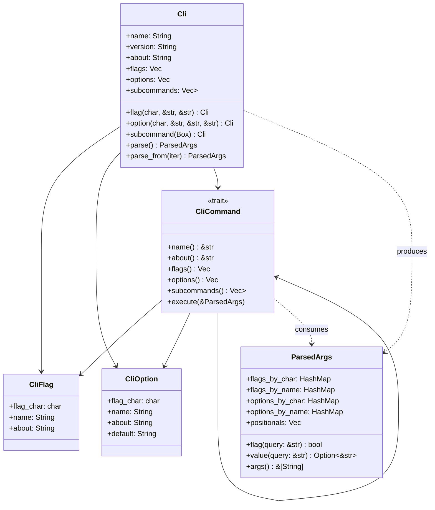

# CLI Toolkit Project (Eshu)

A zero-dependency Rust library for building robust CLI tools with automatic help and man-page generation. 

Following "The Pantheon" convention:
- **Iris**: Messenger of the gods.
- **Pheme**: Goddess of fame and report.
- **Eshu**: East African divine spirit of communication and language, he acts as a messenger between human beings and the deities.

## Design Philosophy

- **Zero Dependencies**: Strictly `std` library only.
- **Shell as Pre-Lexer**: Leverage the fact that the OS/Shell already handles whitespace splitting, quote removal, and globbing.
- **Builder Pattern**: Explicit registration of flags/options to enable automatic documentation generation.
- **Universal Trait**: A single `CliCommand` trait that powers both high-level subcommands and simple script logic.

## Architecture: The "Word" Parser

Since the shell provides a list of normalized strings (`argv`), the parser acts as a single-pass iterator:

| Input | Logic | Result |
| :--- | :--- | :--- |
| `-f` | Flag | `args.flag("f") == true` |
| `-abc` | Bundled Flags | `args.flag("a")`, `args.flag("b")`, `args.flag("c")` are all true |
| `--key=val` | Key-Value | `args.value("key") == Some("val")` |
| `--key`, `val` | Peek-ahead | `args.value("key") == Some("val")` (uses `.peek()` on iterator) |
| `filename.txt`| Positional | Added to `args.args()` list |
| `--` | Stopper | Everything after is treated as a raw positional argument |

## Core API: The Builder Pattern

```rust
fn main() {
    let mut cli = Cli::new("my-tool")
        .version("1.0.0")
        .about("A zero-dependency toolkit")
        // Registration phase
        .flag("v", "verbose", "Enable debug logging")
        .option("p", "port", "The server port", "8080")
        // Subcommand registration (Accepts Box<dyn CliCommand>)
        .subcommand(Box::new(CommitCmd)) 
        // Execute and Parse
        .parse(); 

    if cli.flag("verbose") {
        // ...
    }
}
```

## Subcommand Trait

The `CliCommand` trait allows for both structured objects and simple closures:

```rust
pub trait CliCommand {
    fn name(&self) -> &str;
    fn about(&self) -> &str;
    fn subcommands(&self) -> Vec<Box<dyn CliCommand>>;
    fn execute(&self, args: &ParsedArgs);
}
```

### Unified Integration
- **For Large Apps**: Implement `CliCommand` on custom structs.
- **For Small Tools**: Use a `BasicCommand` struct that takes a `Box<dyn Fn(&ParsedArgs)>` closure.

## Features & Implementation

### 1. Automatic Help & Man Pages
Because all flags and descriptions are registered via the builder, the library can automatically:
- Generate a formatted `--help` / `-h` TUI output.
- Generate a valid **ROFF** format man page via a hidden `--generate-man` flag or by invoking `.render_man_page() -> RoffString`. (I favor the later)
	- https://linux.die.net/man/7/mdoc

### 2. OS Robustness
Use `std::env::args_os()` to handle non-UTF8 file paths correctly, while providing safe `&str` wrappers for flag matching.

### 3. Argument "Trait" Integration
Leverage `std::str::FromStr` to allow users to parse values directly into types:
`let port: u16 = args.value("port").unwrap_or("8080").parse().expect("Invalid port");`

# eshu Public API Design Spec revision

Date: 2026-05-26  

## Goal
Improve the `eshu` command-line parsing API by separating flags, options, and subcommands into structured fields. This fixes existing compilation issues (trying to match trait objects as structs) and establishes a clean, extensible, zero-dependency parsing architecture.

## Architecture

We divide the API into four core components:
1. **CliFlag & CliOption**: Dedicated config types representing boolean flags and key-value options.
2. **CliCommand**: A trait for subcommands, exposing their local flags/options/nested subcommands, and providing an execution hook.
3. **Cli**: The entry point/builder that stores top-level configurations and initiates parsing.
4. **ParsedArgs**: The container for parsed outputs, queryable by both short characters and long names.



---

## Detailed Components

### 1. CliFlag and CliOption

```rust
/// A command-line flag representing a boolean switch (e.g., `-v` or `--verbose`).
#[derive(Debug, Clone, PartialEq, Eq)]
pub struct CliFlag {
    pub flag_char: char,
    pub name: String,
    pub about: String,
}

impl CliFlag {
    pub fn new(flag_char: char, name: &str, about: &str) -> Self {
        Self {
            flag_char,
            name: name.to_string(),
            about: about.to_string(),
        }
    }
}

/// A command-line option that expects an associated value (e.g., `-p 8080` or `--port 8080`).
#[derive(Debug, Clone, PartialEq, Eq)]
pub struct CliOption {
    pub flag_char: char,
    pub name: String,
    pub about: String,
    pub default: String,
}

impl CliOption {
    pub fn new(flag_char: char, name: &str, about: &str, default: &str) -> Self {
        Self {
            flag_char,
            name: name.to_string(),
            about: about.to_string(),
            default: default.to_string(),
        }
    }
}
```

### 2. CliCommand Trait

Custom subcommands implement this trait. Default implementations are provided for `flags`, `options`, and `subcommands` to keep simple subcommands concise.

```rust
use std::fmt::Debug;

pub trait CliCommand<'c>: Debug {
    /// The name of the command.
    fn name(&self) -> &'c str;

    /// The description of the command.
    fn about(&self) -> &'c str;

    /// The flags specific to this command.
    fn flags(&self) -> Vec<CliFlag> {
        Vec::new()
    }

    /// The options specific to this command.
    fn options(&self) -> Vec<CliOption> {
        Vec::new()
    }

    /// A list of subcommands under this command.
    fn subcommands(&self) -> Vec<Box<dyn CliCommand<'c>>> {
        Vec::new()
    }

    /// The function to execute once this command is matched.
    fn execute(&self, args: &'c ParsedArgs);
}
```

### 3. Cli Config & Builder

`Cli` manages the builder interface and entry point.

```rust
pub struct Cli<'a> {
    name: String,
    version: String,
    about: String,
    flags: Vec<CliFlag>,
    options: Vec<CliOption>,
    subcommands: Vec<Box<dyn CliCommand<'a>>>,
}
```

Methods:
* `pub fn new(name: &str) -> Self`
* `pub fn version(mut self, version: &str) -> Self`
* `pub fn about(mut self, about: &str) -> Self`
* `pub fn flag(mut self, flag_char: char, name: &str, about: &str) -> Self`
* `pub fn option(mut self, flag_char: char, name: &str, about: &str, default: &str) -> Self`
* `pub fn subcommand(mut self, cmd: Box<dyn CliCommand<'a>>) -> Self`
* `pub fn parse(&self) -> ParsedArgs` (panics or exits on validation error)
* `pub fn try_parse(&self) -> EshuResult<ParsedArgs>`
* `pub fn try_parse_from<I, T>(&self, iter: I) -> EshuResult<ParsedArgs> where I: IntoIterator<Item = T>, T: Into<String>`

### 4. ParsedArgs

Stores resolved values. Queryable via unified query strings (length 1 for short name lookup, length > 1 for long name lookup).

```rust
pub struct ParsedArgs {
    pub(crate) flags_by_char: HashMap<char, bool>,
    pub(crate) flags_by_name: HashMap<String, bool>,
    pub(crate) options_by_char: HashMap<char, String>,
    pub(crate) options_by_name: HashMap<String, String>,
    pub(crate) positionals: Vec<String>,
}

impl ParsedArgs {
    pub fn flag(&self, query: &str) -> bool { ... }
    pub fn value(&self, query: &str) -> Option<&str> { ... }
    pub fn args(&self) -> &[String] { &self.positionals }
}
```

---

## Parsing Semantics (Iterative Word Parsing)

For any given scope (either top-level `Cli` or a matching `CliCommand`):
1. **Pre-populate Defaults**: Populate `options_by_name` and `options_by_char` with the default values of all registered options.
2. **Arguments Iteration**:
   * If `--` is encountered, consume all remaining arguments as raw positionals.
   * If a word starts with `--`:
     * Split on `=`. E.g., `--port=8080` gives key `"port"`, value `"8080"`. Verify if it's registered. If registered, save to options.
     * Otherwise, check if it's a registered option. If yes, peek/consume the next word as the value.
     * Otherwise, check if it's a registered flag. If yes, set flag to `true`.
     * Otherwise, return error (Unknown long argument).
   * If a word starts with `-` (and is not `--` or just `-`):
     * Loop through each character (bundled flags, e.g., `-abc`):
       * If registered as an option, the option consumes the next word as value.
       * If registered as a flag, set it to `true`.
       * Otherwise, return error (Unknown short argument).
   * If it is a positional argument:
     * Check if it matches a subcommand. If yes:
       * Recurse/delegate parsing of all subsequent arguments to the subcommand's local scope.
       * Execute the subcommand.
       * Stop current parsing level.
     * Otherwise, add to the `positionals` list.
